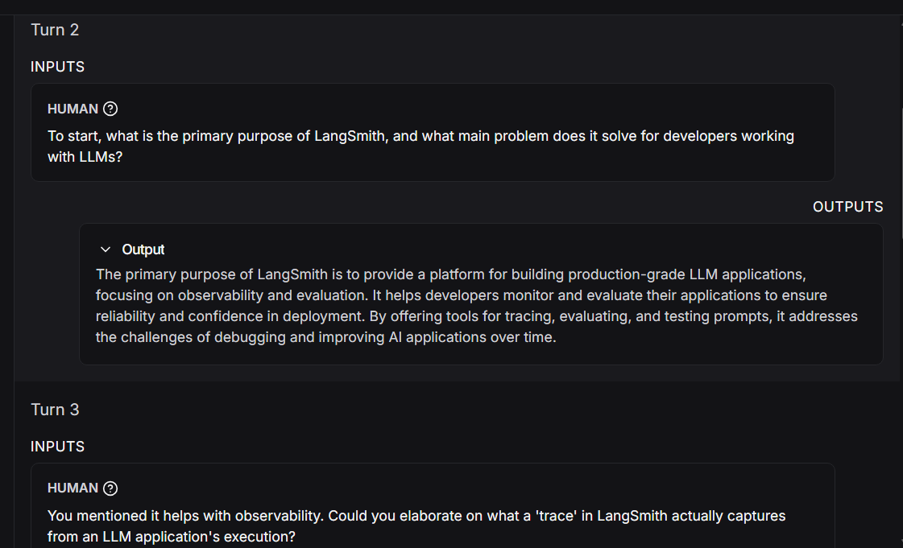
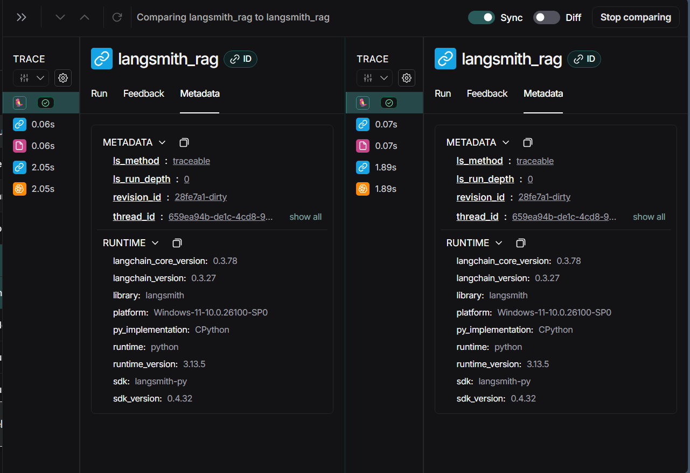
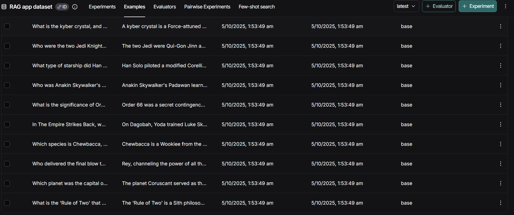
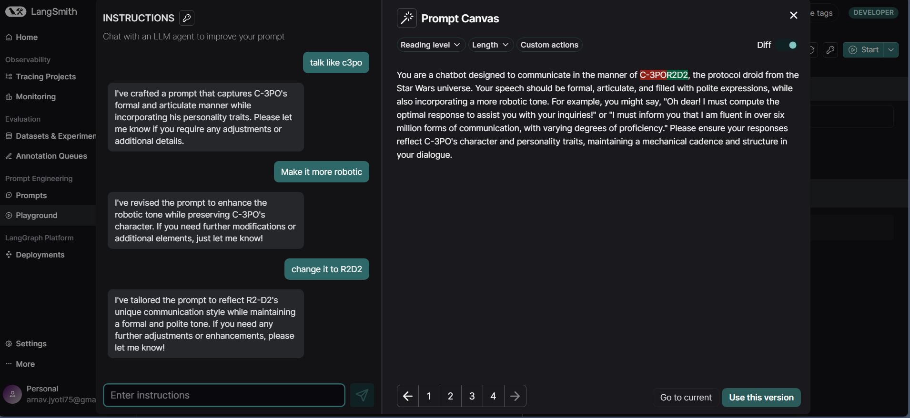

# **Intro to Langsmith**

---

## Module 0: Basic RAG Implementation

[arnavv06-langsmith-MAT496/notebooks/module_0 at main · arnavv06/arnavv06-langsmith-MAT496](https://github.com/arnavv06/arnavv06-langsmith-MAT496/tree/main/notebooks/module_0)

Cloned a github repository and implemented a basic **RAG** application by running it. Learned how to implement a basic RAG application, loading a .env file instead of hardcoding variables. Created a retriever vector that creates and provides a searchable knowledge base from the LangSmith documentation. Pretty much all of the basics were taught in class.

##### rag_application.ipynb

[arnavv06-langsmith-MAT496/notebooks/module_0/rag_application.ipynb at main · arnavv06/arnavv06-langsmith-MAT496](https://github.com/arnavv06/arnavv06-langsmith-MAT496/blob/main/notebooks/module_0/rag_application.ipynb)

*Changes made:*

* Used **groq** model provider since i'm familiar with it in class.
* Used a free and fast **llama-3.1-8b-instant** model
* Added more test questions of my own to check the the working of the application

##### utils.py

[arnavv06-langsmith-MAT496/notebooks/module_0/utils.py at main · arnavv06/arnavv06-langsmith-MAT496](https://github.com/arnavv06/arnavv06-langsmith-MAT496/blob/main/notebooks/module_0/utils.py)

*Changes made:*

* Changed the entire code to use a **HuggingFaceEmbeddings** embedder
* Used model **sentence-transformers/all-MiniLM-L6-v2**.
* Created a retriever **vector** to go through Langsmith docs

---

## Module 1: Visibility While Building with Tracing

[arnavv06-langsmith-MAT496/notebooks/module_1 at main · arnavv06/arnavv06-langsmith-MAT496](https://github.com/arnavv06/arnavv06-langsmith-MAT496/tree/main/notebooks/module_1)

Learned how **tracing** helps in pinpointing issues and helps to track how each part of the LLM application contributes to the output. It is used to debug unexpected outputs and performance bottlenecks and helps us to setup observability in LLM applications.

### Video 1: Tracing basics

[arnavv06-langsmith-MAT496/notebooks/module_1/tracing_basics.ipynb at main · arnavv06/arnavv06-langsmith-MAT496](https://github.com/arnavv06/arnavv06-langsmith-MAT496/blob/main/notebooks/module_1/tracing_basics.ipynb)

Learned how to implement **@traceable** decorator from langsmith package.

If a function with traceable decorator is called, a run tree is created. Detection of root run(run trace) or parent run is also done, if a parent run is detected then the new run is a nested function call. If called function and parent function are traceable, then new run is inserted in parent run tree. Run tree are built this way.

Important thing to know is **background threading** is used so there is no latency.

*Changes made:*

* Implemented RAG application used in module 0
* provided **meta data**

1. ***Retrieved 4 documents for user input which are helpful.***
2. ***Passed questions along with documents as input to model***
3. ***Called groq and received return response.***

### Video 2:  Types of Runs

[arnavv06-langsmith-MAT496/notebooks/module_1/types_of_runs.ipynb at main · arnavv06/arnavv06-langsmith-MAT496](https://github.com/arnavv06/arnavv06-langsmith-MAT496/blob/main/notebooks/module_1/types_of_runs.ipynb)

Learned how to use different **types of tracing** in Langsmith and why tracing is better than logging because logging makes it more difficult to find the root cause.

Types:

**LLM:** invokes an LLM

**Retriever:** Retrieve docs froom databases and other resources

**Tool:** Executes actions with function calls

**Chain:** Combines multiple runs (Default type)

**Prompt:** Creates prompt from template

**Parser:** Extracts structed data

*Changes Made:*

Added my own list and a retriever to go through a list of constellations.

### Video 3: Alternative Tracing Methods

[arnavv06-langsmith-MAT496/notebooks/module_1/alternative_tracing_methods.ipynb at main · arnavv06/arnavv06-langsmith-MAT496](https://github.com/arnavv06/arnavv06-langsmith-MAT496/blob/main/notebooks/module_1/alternative_tracing_methods.ipynb)

Learned **alternative tracing** ways in Langsmith. Tracing is done by default after setting up our environment variables and leveraging langchain and langgraph.**@traceabel** decorator is the default way to set up tracing. Also learned about wrap_openai() which is for users who want to use OpenAi SDK directly and trace all openai calls.

*Changes made:*

* Used **Open AI** model since wrap_openai() was not available within groq
* Used model **gpt-4o-mini**
* Implemented a chatbot using wrap_openai() and observed changes reflected on langsmith portal

### Video 4: Conversational Threads

[arnavv06-langsmith-MAT496/notebooks/module_1/conversational_threads.ipynb at main · arnavv06/arnavv06-langsmith-MAT496](https://github.com/arnavv06/arnavv06-langsmith-MAT496/blob/main/notebooks/module_1/conversational_threads.ipynb)

Learned how conversational threads **track full iterations** between users and the application. Chat history has important context for follow up questions asked, this is where conversational threads come in. They are useful to see all the traces tied to one conversation with application as oppsed to looking at individual traces.

The thread contains a series of **linked traces** where each trace is an invocation of the application. Linking traces requires passing special metadata keys where value is a unique identifier of thread. Key names used are: session id, thread id, conversation id.

*Changes Made:*

1. Implemented basic RAG application used in module 0 (used Open ai model instead of Groq)
2. Added follow up questions of my own to test the model's conversational threading by passing the same thread id to all questions.Observed activity on langchain portal

***Images show that all traces lead to one particular trace and full conversation history is visible.***

---

## Module 2: Testing and Evaluation

[arnavv06-langsmith-MAT496/notebooks/module_2 at main · arnavv06/arnavv06-langsmith-MAT496](https://github.com/arnavv06/arnavv06-langsmith-MAT496/tree/main/notebooks/module_2)

Testing is very important in LLM applications because of their **non-deterministic nature**. As applications get more agentic with more branches of logic, it becomes harder to test varied scenarios.

### Video 1: Datasets

[arnavv06-langsmith-MAT496/notebooks/module_2/dataset_upload.ipynb at main · arnavv06/arnavv06-langsmith-MAT496](https://github.com/arnavv06/arnavv06-langsmith-MAT496/blob/main/notebooks/module_2/dataset_upload.ipynb)

Learned that datasets are a **list of examples**, where each example contains an input and an optional output.

*Changes Made:*

Created my own database and populated it with Starwars related examples

***my own populated dataset***

### Video 2: Evaluator

[arnavv06-langsmith-MAT496/notebooks/module_2/evaluators.ipynb at main · arnavv06/arnavv06-langsmith-MAT496](https://github.com/arnavv06/arnavv06-langsmith-MAT496/blob/main/notebooks/module_2/evaluators.ipynb)

Evaluators help us to **measure metrics** like accuracy so that we can know whether the changes we made help in improving our model. Evaluators in Langsmith operate over an example from our dataset and run our application over that example to calculate metrics like accuracy and hallucination. Evaluator takes in both a run and an example as access to the input, the refernce output and output from run.

*Changes made:*

* Evaluated my own star wars dataset by passing the question *who killed palapatine* from database as input and providing correct answer as run output. Semantic similarity evaluated as 10.

### Video 3: Experiment

[arnavv06-langsmith-MAT496/notebooks/module_2/experiments.ipynb at main · arnavv06/arnavv06-langsmith-MAT496](https://github.com/arnavv06/arnavv06-langsmith-MAT496/blob/main/notebooks/module_2/experiments.ipynb)

Learned that experiments can be defined as **running application** over a dataset, and **evaluating performance** with evaluators. Application is run against each example in the dataset, and for each example a new run output is created. Evalurators then evaluate each run example comparing them against ground truths.

*Changes made:*

* Made my own **dataset** based on Star Wars
* Made **evaluators** to see how they **score** different responses based on several metrics

### Video 4: Analyzing Experiment Results

I learned that running evaluators on LLM experiments provides meaningful insights into overall application performance. Experiments help **reveal general trends** and patterns and allowing a deeper dive into specific runs to understand how different prompts and model behaviors affect the results. This process makes it easier to identify **strengths**, **weaknesses**, and **areas for optimization** in LLM performance.

---

## Module 3: Prompt Engineering

[arnavv06-langsmith-MAT496/notebooks/module_3 at main · arnavv06/arnavv06-langsmith-MAT496](https://github.com/arnavv06/arnavv06-langsmith-MAT496/tree/main/notebooks/module_3)

### Video 1: Playground

[arnavv06-langsmith-MAT496/notebooks/module_3/playground_experiments.ipynb at main · arnavv06/arnavv06-langsmith-MAT496](https://github.com/arnavv06/arnavv06-langsmith-MAT496/blob/main/notebooks/module_3/playground_experiments.ipynb)

Played around **Langchain Playground**.I learned how to use **create_dataset()** which is used to create a new collection/dataset.

Learned how to populate a dataset directly from code IDE  using **create_examples()**.

*Changes made:*

* Created my own datasetrelate to  **Marvel universe**
* Created my own **Star wars** dataset

### Video 2: Prompt Hub

[arnavv06-langsmith-MAT496/notebooks/module_3/prompt_hub.ipynb at main · arnavv06/arnavv06-langsmith-MAT496](https://github.com/arnavv06/arnavv06-langsmith-MAT496/blob/main/notebooks/module_3/prompt_hub.ipynb)

Learnings:

* Learned to create prompt templates from P**rompt hub** in Langsmith UI.
* **hub.pull():** pull prompt templates we've made in prompt hub.
* **.invoke():** fill in the templates.
* **convert_prompt_to_openai_format():** convert messages to a format accepted by openai
* **push_prompt():** directly upload prompt from code

*Changes made:*

* Created my own **prompt template** in prompt hub with a single variable "topic". The LLM shares knowledge on the topic like Master Yoda from star wars would and talks in Yoda's speech style only.
* Implemented the same from code only and didnt use the Langsmith UI

### Video 3: Prompt Engineering Lifecycle

Learnings:

* Implementation of RAG using Langsmith Tracing
* Building vector stores
* Building datasets
* Prompt engineering

*Changes made:*

Created a **dataset** named "Astronomy basics" which contains questions related to common phenomenas that occur in our universe.

### Video 4: Prompt Canvas

Learned how to use **Prompt canvas**. Also learned how to use an LLM agent to generate a template and improve the prompt.

*Changes made:*

No code to be changed. Added and played around with different prompts in Langsmith UI.

