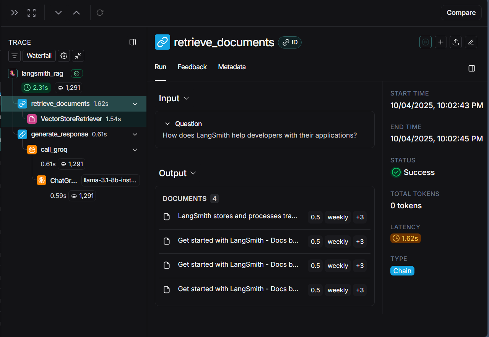

# **Intro to Langsmith**

---

## Module 0

[arnavv06-langsmith-MAT496/notebooks/module_0 at main · arnavv06/arnavv06-langsmith-MAT496](https://github.com/arnavv06/arnavv06-langsmith-MAT496/tree/main/notebooks/module_0)

Cloned a github repository and implemented a basic RAG application by running it. Learned how to implement a basic RAG application, loading a .env file instead of hardcoding variables. Created a retriever vector that creates and provides a searchable knowledge base from the LangSmith documentation. Pretty much all of the basics were taught in class.

##### rag_application.ipynb

[arnavv06-langsmith-MAT496/notebooks/module_0/rag_application.ipynb at main · arnavv06/arnavv06-langsmith-MAT496](https://github.com/arnavv06/arnavv06-langsmith-MAT496/blob/main/notebooks/module_0/rag_application.ipynb)

Changes made:

* Used **groq** model provider since i'm familiar with it in class.
* Used a free and fast **llama-3.1-8b-instant** model
* Udded more test questions of my own to check the the working of the application

##### utils.py

[arnavv06-langsmith-MAT496/notebooks/module_0/utils.py at main · arnavv06/arnavv06-langsmith-MAT496](https://github.com/arnavv06/arnavv06-langsmith-MAT496/blob/main/notebooks/module_0/utils.py)

Changes made:

* Changed the entire code to use a **HuggingFaceEmbeddings** embedder
* Used model sentence-transformers/all-MiniLM-L6-v2.
* Created a retriever vector to go through Langsmith docs

---

## Module 1

### Tracing basics:

Learned how to implement **@traceable** decorator from langsmith package.

If a function with traceable decorator is called, a run tree is created. Detection of root run(run trace) or parent run is also done, if parent run is detected then new run is nested function call. If called function and parent function are traceable, then new run is inserted in parent run tree. Run tree are built this way.

Important thing to know is background threading is used so there is no latency.

Changes:

* Implemented RAG application used in module 0
* provided meta data

1. Retrieved 4 documents for user input which are helpful.
2. Passed questions along with documents as input to model
3. Called groq and received return response.
